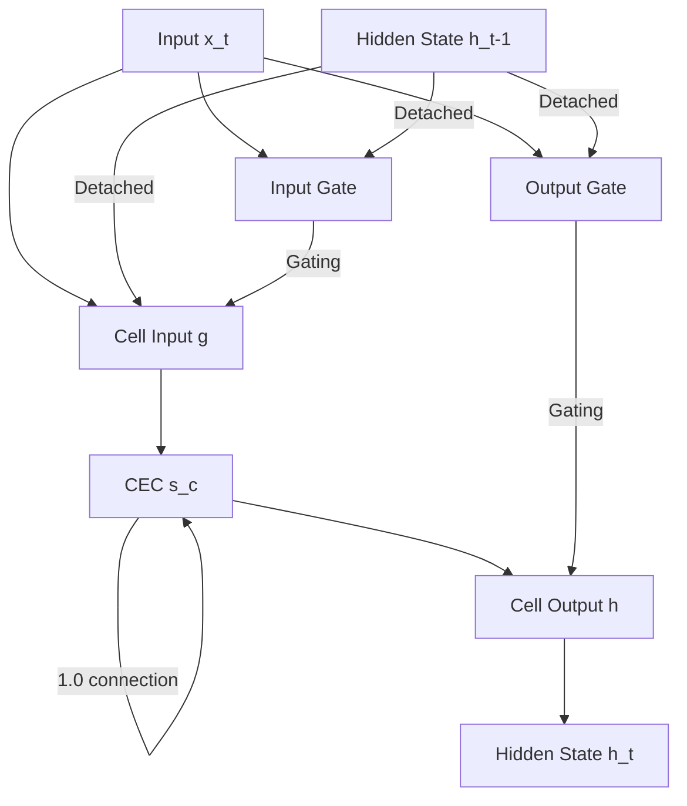

# LSTM 1997 Architecture

This document describes the Long Short-Term Memory (LSTM) architecture as originally proposed by Hochreiter & Schmidhuber in 1997.

## Overview: 1997 LSTM vs. Modern LSTM

The original 1997 LSTM differs significantly from the "standard" LSTM used in modern frameworks (like PyTorch or TensorFlow):

1.  **No Forget Gate**: The 1997 version does not have a forget gate. The internal state is updated by adding new information, but it never "forgets" or scales down the previous state. The forget gate was introduced later by Gers et al. (2000).
2.  **Constant Error Carousel (CEC)**: The core of the 1997 LSTM is the CEC, which ensures that error signals can flow through time without vanishing or exploding.
3.  **Activation Functions**:
    *   **$g(x)$**: Squashes the cell input into the range $[-2, 2]$.
    *   **$h(x)$**: Squashes the cell state into the range $[-1, 1]$ before being gated by the output gate.
4.  **Gate Initialization**: Gates are often initialized with negative biases to start in a "closed" state, preventing the "abuse problem" where gates try to store irrelevant information early in training.

## Constant Error Carousel (CEC)

The CEC is the central component that solves the vanishing gradient problem. It consists of a linear unit with a fixed self-connection weight of **1.0**. 

In the 1997 architecture, the update equation for the cell state $s_c$ is:
$$s_c(t) = s_c(t-1) + y_{in}(t) \cdot g(net_c(t))$$

Because the coefficient of $s_c(t-1)$ is exactly 1.0, the gradient (local error) is preserved perfectly as it flows back through the state. This is referred to as the "1.0 tunnel".

## Truncated Backpropagation Strategy

To achieve $O(1)$ computational complexity per timestep and prevent gradient explosion through multiplicative gates, the 1997 paper uses a specific truncation strategy (often called "the scissors"):

-   **Gradient Tunnel**: Gradients are allowed to flow freely through the CEC ($s_c$ path).
-   **Truncation**: Gradients flowing from the gates back into the recurrent hidden state connections ($y(t-1)$) are **truncated** (detached).

In this implementation, `h_prev.detach()` is called before it enters the input and output gate computations, while `s_c_prev` remains attached to the computational graph. This ensures that the network learns primarily through the error signal preserved in the CEC.

## Memory Cell Blocks & Shared Gates

The 1997 paper introduces "Memory Cell Blocks" to allow the network to store distributed representations more efficiently.

-   **Structure**: A block of size $S$ contains $S$ individual memory cells.
-   **Shared Gates**: All $S$ cells in a single block share the same **input gate** and **output gate**.
-   **Parameter Count**: This significantly reduces the number of weights. For example, in the Adding Problem (Section 5.4), the architecture uses 2 blocks of size 2 (4 cells total), resulting in exactly **93 weights**.

## Implementation: LSTM1997PaperBlock

The `LSTM1997PaperBlock` class in `src/aquarius_lstm/cell_torch.py` provides a paper-exact implementation of the shared gate architecture. It supports a `truncate` toggle to enable/disable the "scissors" strategy for verification purposes.

## Gate Pre-training Acceleration

One key deviation from the original paper is the use of **Gate Pre-training**. We found that with the paper's suggested negative biases (-3.0 to -6.0), input gates are too closed for gradients to flow effectively early in training. We use a short pre-training phase to "teach" the gates to respond to marker signals, which accelerates convergence from ~500K sequences to ~30K sequences.

## Architecture Diagram (Schematic)

*(Note: In the 1997 architecture, the recurrent connections to the gates are detached to enforce truncated backpropagation.)*
